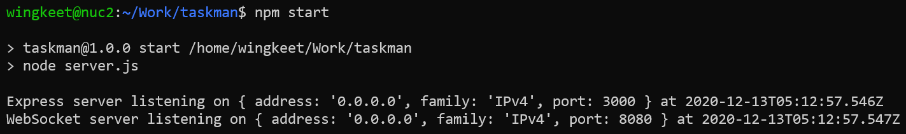

# taskman
Simple Node.js task manager that supports task queue and pool of workers for multiprocessing.

### Introduction
`taskman` is a Node.js module that offers a developer-friendly API to manage long-running tasks.
Configurable options are shown below:
- Number of worker processes; must be >= 1.
- Maximum queue length; must be >= 0 or Infinity.
- A callback function to be notified when a task is complete.

### Prerequisites
- The file `taskman.js` requires Node.js >= 14.0.0 due to usage of the optional chaining
operator (?.) from ES2020.
- The file `taskman.js` has one external dependency, i.e.,
[bson](https://www.npmjs.com/package/bson), which is used to generate MongoDB ObjectIds.

### Getting Started
We are going to start a Node.js process which hosts a HTTP server and a WebSocket server.
Before we do that, use your code editor's Find in Files feature to search for the string
`EDIT:`. There are two places where you need to indicate the URLs of those servers.

Next, type `npm start` on the command line to start the servers. Then point your web
browser to the HTTP server and the live demo should appear. Click the Submit button
5 times in quick succession. You should see some messages similar to those shown below.

Each time the Submit button is clicked, a task is sent from the web browser (via the
[WebSocket API](https://developer.mozilla.org/en-US/docs/Web/API/WebSockets_API))
to the WebSocket server. For this live demo, I have configured the `taskman`
module with 2 workers and a maximum queue length of 2. Messages #1 and #2 show that the
first two tasks have been assigned to the two workers. Messages #3 and #4 show that the
next two tasks have been put in the queue, since all the workers are busy. Message #5
shows that the last task is rejected because all the workers are busy *and* the queue
has reached its maximum configured capacity.

Messages #6 through #9 represent the results of the tasks. The `tookms` property
indicates the wall time (in milliseconds) the worker took to complete the task.

The `taskman` module generates a `taskId` to uniquely identify a task. This taskId
is the same 24-digit ObjectId used in MongoDB.

You should customize the `doWork()` function in
[`worker.js`](https://github.com/wingkeet/taskman/blob/master/worker.js)
For the purpose of this demo, I have written it such that it accepts a JavaScript
`Number` as a task; real-world applications would most likely use a JavaScript
`Object` instead. The `doWork()` function sleeps for the given number of seconds
and returns the double of the number as the result. It also produces an output file to
be downloaded by the end user. If the task is a negative number, an error is produced.

### Sequence Diagram

### Using the taskman module in a Node.js program

### Authors
* **Steve Leong** - *Initial work*

### License
This project is licensed under the [MIT License](https://opensource.org/licenses/MIT) -
see the [LICENSE](https://github.com/wingkeet/taskman/blob/master/LICENSE) file for details.
